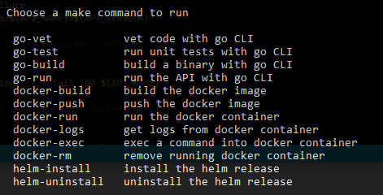

# Go Micro API

Micro API made with Golang to run on containerized environments

## Using Makefile

```bash
make
```


## Running with Docker Compose

```bash
docker-compose up -d --build go-micro-api
docker-compose logs -f --tail 100 go-micro-api

docker-compose up -d prometheus grafana
docker-compose logs -f --tail 100 prometheus grafana
```

## Running with Docker

```bash
docker image build --tag juliocesarmidia/go-micro-api:v1.0.0 ./src

docker image ls \
  --format "table {{.ID}}\t{{.Repository}}\t{{.Tag}}\t{{.Size}}" \
  --filter="reference=juliocesarmidia/go-micro-api:v1.0.0"
# approximately 14MB

docker image push juliocesarmidia/go-micro-api:v1.0.0

docker image history juliocesarmidia/go-micro-api:v1.0.0 --no-trunc

docker container run -d \
  --name go-micro-api \
  --publish 9000:9000 \
  --cap-drop ALL \
  --memory='32MB' \
  --cpus='1' \
  --env MESSAGE="Hello World From Docker" \
  --env ENVIRONMENT="development" \
  --restart on-failure \
  juliocesarmidia/go-micro-api:v1.0.0

# updates memory request
docker container update --memory='512MB' go-micro-api

docker container stats go-micro-api --no-stream
docker container top go-micro-api

docker container inspect go-micro-api

docker container logs -f --tail 100 go-micro-api

curl --url 'http://localhost:9000/api/v1/message'
curl --url 'http://localhost:9000/api/v1/ping'
curl --url 'http://localhost:9000/api/v1/health/live'
curl --url 'http://localhost:9000/api/v1/health/ready'
curl --url 'http://localhost:9000/metrics'

curl -o /dev/null -s -w "dnslookup: %{time_namelookup} seconds | connect: %{time_connect} seconds | pre transfer: %{time_pretransfer} seconds | start transfer: %{time_starttransfer} seconds | total: %{time_total} seconds | size: %{size_download} bytes\n" --url 'http://localhost:9000/api/v1/message'

docker container rm -f go-micro-api
```

## Running with Kubernetes

```bash
kubectl apply -f k8s/deployment.yaml

# it requires nginx ingress installed
INGRESS_IP=$(kubectl get service -n ingress-nginx \
  -l app.kubernetes.io/instance=ingress-nginx --no-headers \
  | tr -s ' ' ' ' | cut -d' ' -f3)
echo "${INGRESS_IP} api.golang.local" >> /etc/hosts

curl --url 'http://api.golang.local/api/v1/message'
curl --url 'http://api.golang.local/api/v1/ping'
curl --url 'http://api.golang.local/api/v1/health/live'
curl --url 'http://api.golang.local/api/v1/health/ready'
curl --url 'http://api.golang.local/metrics'

kubectl get pod,svc,rs,ingress,networkpolicy -n default

kubectl logs -f \
  -l app.kubernetes.io/name=go-micro-api \
  -n default --tail 100 --timestamps

kubectl delete -f k8s/deployment.yaml
```

## Testing API benchmark with siege, wrk or artillery

```bash
siege --time 30S --concurrent 255 --benchmark 'http://localhost:9000/api/v1/message'

wrk --threads $(nproc) --connections 255 --duration 30s --timeout 1s 'http://localhost:9000/api/v1/message' --latency

artillery run load-tests/api-message-load-test.yml --output load-tests/api-message.json
artillery report load-tests/api-message.json
```

## Prometheus

> Prometheus default user: 'admin' 'L4SlYsfPkja85jh32aV1'

> Generate encrypted password

```bash
htpasswd -nb -B admin 'L4SlYsfPkja85jh32aV1'
# output (it should be different each generation)
admin:$2y$05$fGod0Ng2/gGoFm7nBwAFreiYRf.fMrs28dRpWCl4Zhn5Jtvca1.Fa

AUTH="$(echo -n 'admin:L4SlYsfPkja85jh32aV1' | base64 -w0)"

curl --silent -H "Authorization: Basic ${AUTH}" \
  http://localhost:9090/metrics

curl --silent http://localhost:9000/metrics | grep 'gomicroapi_http_request_count'

curl --silent http://localhost:9000/metrics | grep 'gomicroapi_http_request_duration_seconds'
```
