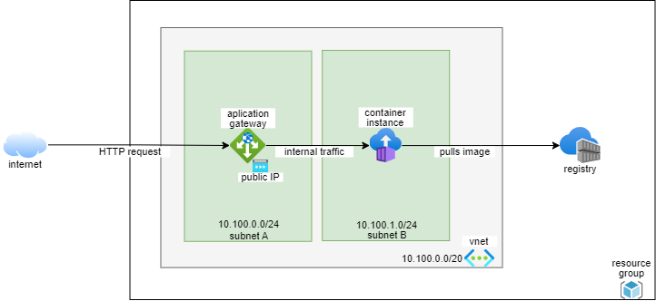

# Running with Azure Container Instances

## Architecture



## Preparing resources

```bash
LOCATION="eastus"
RESOURCE_GROUP="go-micro-api-rg"
API_NAME="go-micro-api"
# log analytics settings
LOG_ANALYTICS_WORKSPACE_NAME="$API_NAME-log-analytics"
# network settings
VNET_NAME="$API_NAME-vnet"
SUBNETS_PREFIX_NAME="$API_NAME-subnet"
# application gateway settings
APP_GW_NAME="$API_NAME-app-gw"
APP_GW_IP_NAME="$API_NAME-pub-ip"
# registry settings
REGISTRY_USERNAME="gomicroapi"
REGISTRY_URL="$REGISTRY_USERNAME.azurecr.io"


# create resource group
az group create --name $RESOURCE_GROUP --location $LOCATION


# network config
LB_SUBNET_NAME="${SUBNETS_PREFIX_NAME}-a"
az network vnet create \
  --name $VNET_NAME \
  --resource-group $RESOURCE_GROUP \
  --location $LOCATION \
  --address-prefix 10.100.0.0/20 \
  --subnet-name "$LB_SUBNET_NAME" \
  --subnet-prefix 10.100.0.0/24

CONTAINER_SUBNET_NAME="${SUBNETS_PREFIX_NAME}-b"
CONTAINER_SUBNET_ID=$(az network vnet subnet create \
  --name "$CONTAINER_SUBNET_NAME" \
  --resource-group $RESOURCE_GROUP \
  --vnet-name $VNET_NAME \
  --address-prefix 10.100.1.0/24 \
  --query "id" --out tsv)

# add delegation for container subnet
az network vnet subnet update --resource-group $RESOURCE_GROUP -n $CONTAINER_SUBNET_NAME --vnet-name $VNET_NAME --delegations 'Microsoft.ContainerInstance.containerGroups'

# replace config on yaml file
sed -i "s/{{SUBNET_NAME}}/${CONTAINER_SUBNET_NAME}/" container-group.yaml

CONTAINER_SUBNET_ID=$(echo "$CONTAINER_SUBNET_ID" | sed -r 's/\//\\\//gm')
sed -i "s/{{SUBNET_ID}}/${CONTAINER_SUBNET_ID}/" container-group.yaml


# create log analytics workspace
az monitor log-analytics workspace create --resource-group $RESOURCE_GROUP --workspace-name $LOG_ANALYTICS_WORKSPACE_NAME --location $LOCATION

WORKSPACE_ID=$(az monitor log-analytics workspace show --resource-group $RESOURCE_GROUP --workspace-name $LOG_ANALYTICS_WORKSPACE_NAME --query "customerId" --out tsv)
# replace config on yaml file
sed -i "s/{{WORKSPACE_ID}}/${WORKSPACE_ID}/" container-group.yaml

WORKSPACE_KEY=$(az monitor log-analytics workspace get-shared-keys --resource-group $RESOURCE_GROUP --workspace-name $LOG_ANALYTICS_WORKSPACE_NAME --query "primarySharedKey" --out tsv)
WORKSPACE_KEY=$(echo "$WORKSPACE_KEY" | sed -r 's/\//\\\//gm')
# replace config on yaml file
sed -i "s/{{WORKSPACE_KEY}}/${WORKSPACE_KEY}/" container-group.yaml


# create acr repository
az acr create --resource-group $RESOURCE_GROUP --name $REGISTRY_USERNAME --sku Basic
# enable admin password
az acr update --admin-enabled true --resource-group $RESOURCE_GROUP --name $REGISTRY_USERNAME
# retrieve password
REGISTRY_PASSWORD="$(az acr credential show --resource-group $RESOURCE_GROUP --name $REGISTRY_USERNAME --query passwords[0].value | sed 's/^"//; s/"$//')"
# login
echo "$REGISTRY_PASSWORD" | docker login "$REGISTRY_URL" --username "$REGISTRY_USERNAME" --password-stdin

# get image from docker and push to acr
docker image pull "docker.io/juliocesarmidia/go-micro-api:v1.0.0"
docker image tag "docker.io/juliocesarmidia/go-micro-api:v1.0.0" "$REGISTRY_URL/go-micro-api:v1.0.0"
docker image push "$REGISTRY_URL/go-micro-api:v1.0.0"


# replace more configs on yaml
REGISTRY_PASSWORD=$(echo "$REGISTRY_PASSWORD" | sed -r 's/\//\\\//gm')
sed -i "s/{{REGISTRY_USERNAME}}/${REGISTRY_USERNAME}/; s/{{REGISTRY_PASSWORD}}/${REGISTRY_PASSWORD}/" container-group.yaml

# replace location
sed -i "s/{{LOCATION}}/${LOCATION}/" container-group.yaml
```

## Creating the load balancer and container group

```bash
# create container group
az container create --resource-group $RESOURCE_GROUP --file container-group.yaml
# retrieve private container ip
CONTAINER_IP=$(az container show \
  --resource-group $RESOURCE_GROUP \
  --name $API_NAME \
  --query ipAddress.ip --output tsv)


# create public ip to application gateway
az network public-ip create \
  --resource-group $RESOURCE_GROUP \
  --name $APP_GW_IP_NAME \
  --allocation-method Static \
  --sku Standard

# create application gateway
az network application-gateway create \
  --name $APP_GW_NAME \
  --location $LOCATION \
  --resource-group $RESOURCE_GROUP \
  --capacity 2 \
  --sku Standard_v2 \
  --http-settings-protocol http \
  --priority 1000 \
  --public-ip-address $APP_GW_IP_NAME \
  --vnet-name $VNET_NAME \
  --subnet $LB_SUBNET_NAME \
  --servers "$CONTAINER_IP"

# adjust gateway healthcheck
PROBE_NAME="healthProbe"
az network application-gateway probe create \
  --resource-group $RESOURCE_GROUP \
  --gateway-name $APP_GW_NAME \
  -n $PROBE_NAME --protocol http \
  --host '127.0.0.1' \
  --path '/api/v1/health/live' \
  --port 9000 --interval 15 \
  --timeout 10 --threshold 5

# adjust http settings
APP_GW_BACKEND_SETTINGS_NAME=$(az network application-gateway http-settings list --resource-group $RESOURCE_GROUP --gateway-name $APP_GW_NAME --query '[0].name' --output tsv)

az network application-gateway http-settings update \
  --resource-group $RESOURCE_GROUP \
  --gateway-name $APP_GW_NAME \
  -n $APP_GW_BACKEND_SETTINGS_NAME \
  --port 9000 --protocol http \
  --enable-probe true --probe $PROBE_NAME
```

## Validating workloads and retrieving logs

```bash
# show public ip
LB_IP=$(az network public-ip show \
  --resource-group $RESOURCE_GROUP \
  --name $APP_GW_IP_NAME \
  --query [ipAddress] --output tsv)

curl --url "http://${LB_IP}/api/v1/message"
# {"data":"Hello World From ACI","statusCode":200}

# 5 minutes
siege --time 300s --concurrent 255 --benchmark "http://${LB_IP}/api/v1/message"


# execute commands on container
az container exec --resource-group $RESOURCE_GROUP --name $API_NAME --exec-command "/bin/sh"

# get logs from container
az container logs --resource-group $RESOURCE_GROUP --name $API_NAME --follow

# query to get some logs on log analytics
ContainerInstanceLog_CL
| project parse_json(Message)
| project
  Host = Message.host,
  Ip = Message.ip,
  Msg = Message.message,
  Method = Message.method,
  Path = Message.path,
  Severity = Message.severity,
  Timestamp = Message.timestamp
| where Path hasprefix "/api/v1/message"
| order by totimespan(Timestamp) desc
| take 10


# clean up
az group delete --name $RESOURCE_GROUP --yes
```

## References

> https://learn.microsoft.com/pt-BR/azure/container-instances/container-instances-multi-container-yaml

> https://learn.microsoft.com/en-us/azure/container-instances/container-instances-quickstart

> https://learn.microsoft.com/en-us/azure/container-instances/container-instances-vnet

> https://learn.microsoft.com/en-us/azure/container-instances/container-instances-application-gateway

> https://learn.microsoft.com/en-us/azure/container-instances/container-instances-log-analytics
