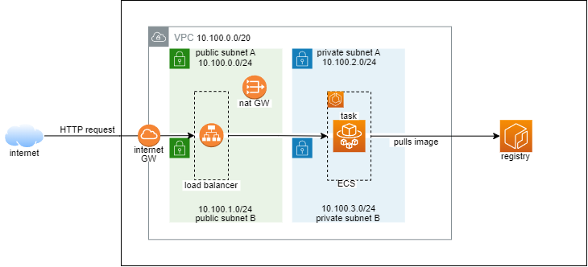

# Running with Elastic Container Service

## Architecture



## Preparing resources

```bash
REGION="us-east-1"
API_NAME="go-micro-api"
# ecs config
ECS_CLUSTER="$API_NAME-cluster"
ECS_SG_NAME="$API_NAME-sg"
# load balancer config
ALB_NAME="$API_NAME-alb"
ALB_SG_NAME="$API_NAME-alb-sg"
ALB_TG_NAME="$API_NAME-tg"
# vpc config
VPC_NAME="$API_NAME-vpc"
INT_GW_NAME="$API_NAME-int-gw"
NAT_GW_NAME="$API_NAME-nat-gw"
SUBNETS_PREFIX_NAME="$API_NAME-subnet"
PUBLIC_ROUTE_TB_NAME="$API_NAME-public-rt"
PRIVATE_ROUTE_TB_NAME="$API_NAME-private-rt"

# get account id, it will be used later
ACCOUNT_ID=$(aws sts get-caller-identity --query 'Account' --output text)


# vpc config, create vpc with 2 public and 2 private subnets
# min 10.100.0.0
# max 10.100.15.255
VPC_ID=$(aws ec2 create-vpc --region $REGION \
  --cidr-block 10.100.0.0/20 \
  --tag-specification ResourceType=vpc,Tags="[{Key=Name,Value=$VPC_NAME}]" \
  --query 'Vpc.VpcId' --output text)
# enable dns hostnames for vpc
aws ec2 modify-vpc-attribute --region $REGION \
  --vpc-id "$VPC_ID" --enable-dns-hostnames '{"Value":true}'


# create internet gateway
INT_GW_ID=$(aws ec2 create-internet-gateway --region $REGION --tag-specification ResourceType=internet-gateway,Tags="[{Key=Name,Value=$INT_GW_NAME}]" --query 'InternetGateway.InternetGatewayId' --output text)
# attach internet gateway to vpc
aws ec2 attach-internet-gateway --region $REGION \
  --internet-gateway-id "$INT_GW_ID" --vpc-id "$VPC_ID"


# public subnets setup
# create route table
PUBLIC_RT_ID=$(aws ec2 create-route-table \
  --region $REGION \
  --vpc-id "$VPC_ID" \
  --tag-specification ResourceType=route-table,Tags="[{Key=Name,Value=$PUBLIC_ROUTE_TB_NAME}]" \
  --query 'RouteTable.RouteTableId' --output text)
# add route to internet gateway
aws ec2 create-route --region $REGION --route-table-id "$PUBLIC_RT_ID" --destination-cidr-block "0.0.0.0/0" --gateway-id "$INT_GW_ID"

function create_public_subnet() {
  local SUBNET_NAME="$1"
  local CIDR="$2"
  local AZ="$3"
  local VPC_ID="$4"
  local RT_ID="$5"
  SUBNET_ID=$(aws ec2 create-subnet --region $REGION \
    --cidr-block "$CIDR" \
    --availability-zone "$AZ" \
    --vpc-id "$VPC_ID" \
    --tag-specification ResourceType=subnet,Tags="[{Key=Name,Value=$SUBNET_NAME}]" \
    --query 'Subnet.SubnetId' --output text)
  # use public ip
  aws ec2 modify-subnet-attribute --region $REGION --subnet-id "$SUBNET_ID" --map-public-ip-on-launch 1> /dev/null
  # associate subnet with public route table
  aws ec2 associate-route-table --region $REGION --subnet-id "$SUBNET_ID" --route-table-id "$RT_ID" 1> /dev/null
  echo "$SUBNET_ID"
}
PUBLIC_SUBNET_ID_A=$(create_public_subnet "${SUBNETS_PREFIX_NAME}-public-a" "10.100.0.0/24" "${REGION}a" "$VPC_ID" "$PUBLIC_RT_ID")
PUBLIC_SUBNET_ID_B=$(create_public_subnet "${SUBNETS_PREFIX_NAME}-public-b" "10.100.1.0/24" "${REGION}b" "$VPC_ID" "$PUBLIC_RT_ID")

PUBLIC_SUBNET_IDS="$PUBLIC_SUBNET_ID_A,$PUBLIC_SUBNET_ID_B"
echo "$PUBLIC_SUBNET_IDS"


# private subnets setup
# allocate public ip
EIP_ALLOC_ID=$(aws ec2 allocate-address --region $REGION --query 'AllocationId' --output text)
# create nat gateway
NAT_GW_ID=$(aws ec2 create-nat-gateway --region $REGION \
  --subnet-id $PUBLIC_SUBNET_ID_A \
  --tag-specification ResourceType=natgateway,Tags="[{Key=Name,Value=$NAT_GW_NAME}]" \
  --allocation-id $EIP_ALLOC_ID \
  --query 'NatGateway.NatGatewayId' --output text)
# create route table
PRIVATE_RT_ID=$(aws ec2 create-route-table \
  --region $REGION \
  --vpc-id "$VPC_ID" \
  --tag-specification ResourceType=route-table,Tags="[{Key=Name,Value=$PRIVATE_ROUTE_TB_NAME}]" \
  --query 'RouteTable.RouteTableId' --output text)

function create_private_subnet() {
  local SUBNET_NAME="$1"
  local CIDR="$2"
  local AZ="$3"
  local VPC_ID="$4"
  local RT_ID="$5"
  SUBNET_ID=$(aws ec2 create-subnet --region $REGION \
    --cidr-block "$CIDR" \
    --availability-zone "$AZ" \
    --vpc-id "$VPC_ID" \
    --tag-specification ResourceType=subnet,Tags="[{Key=Name,Value=$SUBNET_NAME}]" \
    --query 'Subnet.SubnetId' --output text)
   # associate subnet with private route table
  aws ec2 associate-route-table --region $REGION --subnet-id "$SUBNET_ID" --route-table-id "$RT_ID" 1> /dev/null
  echo "$SUBNET_ID"
}
PRIVATE_SUBNET_ID_A=$(create_private_subnet "${SUBNETS_PREFIX_NAME}-private-a" "10.100.2.0/24" "${REGION}a" "$VPC_ID" "$PRIVATE_RT_ID")
PRIVATE_SUBNET_ID_B=$(create_private_subnet "${SUBNETS_PREFIX_NAME}-private-b" "10.100.3.0/24" "${REGION}b" "$VPC_ID" "$PRIVATE_RT_ID")

PRIVATE_SUBNET_IDS="$PRIVATE_SUBNET_ID_A,$PRIVATE_SUBNET_ID_B"
echo "$PRIVATE_SUBNET_IDS"

# wait a little until nat gateway will be available
sleep 30
# route to nat gateway
aws ec2 create-route --region $REGION --route-table-id "$PRIVATE_RT_ID" --destination-cidr-block "0.0.0.0/0" --nat-gateway-id "$NAT_GW_ID"


# cloudwatch log group
aws logs create-log-group --region $REGION --log-group-name "/aws/ecs/$API_NAME"
aws logs put-retention-policy --region $REGION --log-group-name "/aws/ecs/$API_NAME" --retention-in-days 1


# create ecr repository
aws ecr create-repository --repository-name $API_NAME --region $REGION
REGISTRY_URL="$ACCOUNT_ID.dkr.ecr.$REGION.amazonaws.com"
# login
aws ecr get-login-password --region $REGION | \
  docker login --username AWS $REGISTRY_URL --password-stdin

# get image from docker and push to ecr
docker image pull "docker.io/juliocesarmidia/go-micro-api:v1.0.0"
docker image tag "docker.io/juliocesarmidia/go-micro-api:v1.0.0" "$REGISTRY_URL/go-micro-api:v1.0.0"
docker image push "$REGISTRY_URL/go-micro-api:v1.0.0"


# create task execution role for ecs => AmazonECSTaskExecutionRole
aws iam create-role --role-name AmazonECSTaskExecutionRole \
  --assume-role-policy-document file://./AmazonECSTaskExecutionRole.json

aws iam attach-role-policy \
  --policy-arn "arn:aws:iam::aws:policy/service-role/AmazonECSTaskExecutionRolePolicy" \
  --role-name AmazonECSTaskExecutionRole
aws iam attach-role-policy \
  --policy-arn "arn:aws:iam::aws:policy/AmazonECS_FullAccess" \
  --role-name AmazonECSTaskExecutionRole

# create task role for ecs => AmazonECSTaskRole
aws iam create-role --role-name AmazonECSTaskRole \
  --assume-role-policy-document file://./AmazonECSTaskRole.json

ECS_TASK_POLICY_ARN=$(aws iam create-policy --policy-name AmazonECSTaskRolePolicy \
  --policy-document file://./AmazonECSTaskRolePolicy.json \
  --query 'Policy.Arn' --output text)
aws iam attach-role-policy --policy-arn $ECS_TASK_POLICY_ARN \
  --role-name AmazonECSTaskRole
```

## Creating the load balancer and ECS

```bash
# create ecs cluster
aws ecs create-cluster --region $REGION --cluster-name $ECS_CLUSTER

# replacing info on task.json
sed -i "s/{{ACCOUNT_ID}}/${ACCOUNT_ID}/; s/{{REGION}}/${REGION}/; s/{{API_NAME}}/${API_NAME}/" task.json

aws ecs register-task-definition --region $REGION --cli-input-json file://./task.json

TASK_DEF=$(aws ecs list-task-definitions --region $REGION --query 'taskDefinitionArns[0]' --output text | awk -F'/' '{print $2}')

# create SG for load balancer
ALB_SG_ID=$(aws ec2 create-security-group --region $REGION --group-name $ALB_SG_NAME --description $ALB_SG_NAME --vpc-id $VPC_ID --query 'GroupId' --output text)

aws ec2 authorize-security-group-ingress --region $REGION --group-id $ALB_SG_ID --protocol tcp --port 80 --cidr 0.0.0.0/0

# create SG for API
ECS_SG_ID=$(aws ec2 create-security-group --region $REGION --group-name $ECS_SG_NAME --description $ECS_SG_NAME --vpc-id $VPC_ID --query 'GroupId' --output text)

aws ec2 authorize-security-group-ingress --region $REGION --group-id $ECS_SG_ID --protocol tcp --port 9000 --source-group $ALB_SG_ID

# create target group
ALB_TG_ARN=$(aws elbv2 create-target-group \
  --region $REGION \
  --name $ALB_TG_NAME \
  --protocol HTTP \
  --port 80 \
  --health-check-port 9000 \
  --health-check-path "/api/v1/health/live" \
  --health-check-protocol HTTP \
  --target-type ip \
  --vpc-id $VPC_ID \
  --query 'TargetGroups[0].TargetGroupArn' --output text)

# create load balancer
ALB_ARN=$(aws elbv2 create-load-balancer \
  --region $REGION \
  --name $ALB_NAME \
  --scheme internet-facing \
  --subnets $(echo $PUBLIC_SUBNET_IDS | tr -s ',' ' ') \
  --security-groups $ALB_SG_ID \
  --query 'LoadBalancers[0].LoadBalancerArn' --output text)

# create listener
aws elbv2 create-listener --region $REGION \
  --load-balancer-arn $ALB_ARN \
  --protocol HTTP --port 80 \
  --default-actions Type=forward,TargetGroupArn=$ALB_TG_ARN

# create service bound to the target group
ALB_TG_ARN=$(echo "$ALB_TG_ARN" | sed -r 's/\//\\\//gm')
sed -i "s/{{ALB_TG_ARN}}/${ALB_TG_ARN}/; s/{{API_NAME}}/${API_NAME}/" service.json

aws ecs create-service --region $REGION \
  --cluster $ECS_CLUSTER \
  --service-name $API_NAME \
  --task-definition $TASK_DEF \
  --desired-count 1 \
  --launch-type "FARGATE" \
  --enable-execute-command \
  --network-configuration "awsvpcConfiguration={subnets=[$PRIVATE_SUBNET_IDS],securityGroups=[$ECS_SG_ID],assignPublicIp=DISABLED}" \
  --cli-input-json file://./service.json

aws ecs list-services --region $REGION --cluster $ECS_CLUSTER

# check load balancer DNS
ALB_DNS=$(aws elbv2 describe-load-balancers --region $REGION --name $ALB_NAME --query 'LoadBalancers[0].DNSName' --output text)

curl --url "http://${ALB_DNS}/api/v1/message"
# {"data":"Hello World From ECS","statusCode":200}


# enable execution of commands, it requires a special policy and task role
aws ecs update-service --region $REGION --cluster $ECS_CLUSTER --service $API_NAME --enable-execute-command --force-new-deployment

TASK_ID=$(aws ecs list-tasks --region $REGION --cluster $ECS_CLUSTER --service $API_NAME --output text --query 'taskArns[0]')

aws ecs describe-tasks --region $REGION --cluster $ECS_CLUSTER --tasks $TASK_ID

aws ecs execute-command --region $REGION --cluster $ECS_CLUSTER --task $TASK_ID --container $API_NAME --command "/bin/sh" --interactive


# query to get some logs on cloudwatch
fields host, ip, message as msg, method, path, severity, timestamp
| sort @timestamp desc
| filter path ~= '/api/v1/message'
| limit 10
```

## References

> https://docs.aws.amazon.com/AmazonECS/latest/developerguide/ECS_AWSCLI_Fargate.html
> https://docs.aws.amazon.com/cli/latest/userguide/cli-services-ec2-sg.html
> https://docs.aws.amazon.com/cli/latest/reference/ecs/create-service.html
> https://docs.aws.amazon.com/cli/latest/reference/elbv2/create-load-balancer.html
> https://docs.aws.amazon.com/cli/latest/reference/ecs/register-task-definition.html
> https://docs.aws.amazon.com/pt_br/elasticloadbalancing/latest/application/tutorial-application-load-balancer-cli.html
