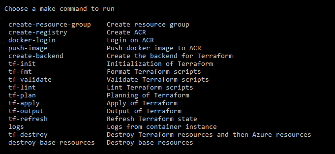

# Running with Azure Container Instances using Terraform

## Using Makefile

```bash
make
```


## Up and Running

```bash
cd terraform/aci

# create the ACR repository, login into the ACR, pull image from DockerHub and pushes the image to ACR
make push-image

# create the backend storage account on Azure (if doesn't exist, this could take a few minutes) and initializes the terraform
make tf-init

# validate and lint the terraform, then do the plan
make tf-plan

# apply the previous plan
make tf-apply

# show application gateway ip
LB_IP=$(make tf-output)
curl --url "http://${LB_IP}/api/v1/message"

# clean up
make tf-destroy
```
