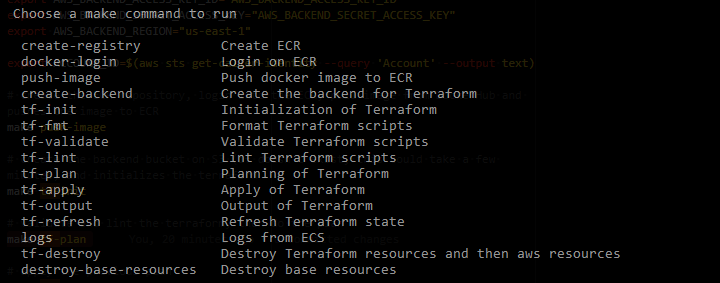

# Running with ECS using Terraform

## Using Makefile

```bash
make
```


## Up and Running

```bash
cd terraform/ecs

export AWS_ACCESS_KEY_ID="AWS_ACCESS_KEY_ID"
export AWS_SECRET_ACCESS_KEY="AWS_SECRET_ACCESS_KEY"
export AWS_DEFAULT_REGION="us-east-1"

export AWS_BACKEND_ACCESS_KEY_ID="AWS_BACKEND_ACCESS_KEY_ID"
export AWS_BACKEND_SECRET_ACCESS_KEY="AWS_BACKEND_SECRET_ACCESS_KEY"
export AWS_BACKEND_REGION="us-east-1"

export ACCOUNT_ID=$(aws sts get-caller-identity --query 'Account' --output text)

# create the ECR repository, login into the ECR, pull image from DockerHub and pushes the image to ECR
make push-image

# create the backend bucket on S3 (if doesn't exist, this could take a few minutes) and initializes the terraform
make tf-init

# validate and lint the terraform, then do the plan
make tf-plan

# apply the previous plan
make tf-apply

# show application gateway ip
LB_DNS=$(make tf-output)
curl --url "http://${LB_DNS}/api/v1/message"

# clean up
make tf-destroy
```
